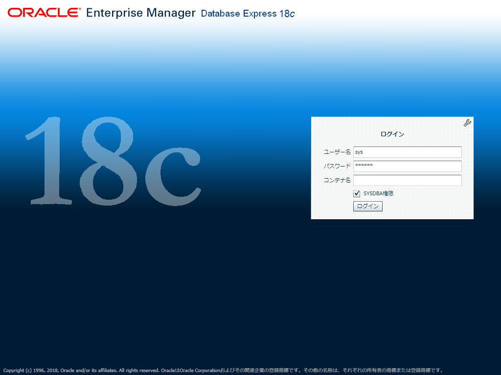
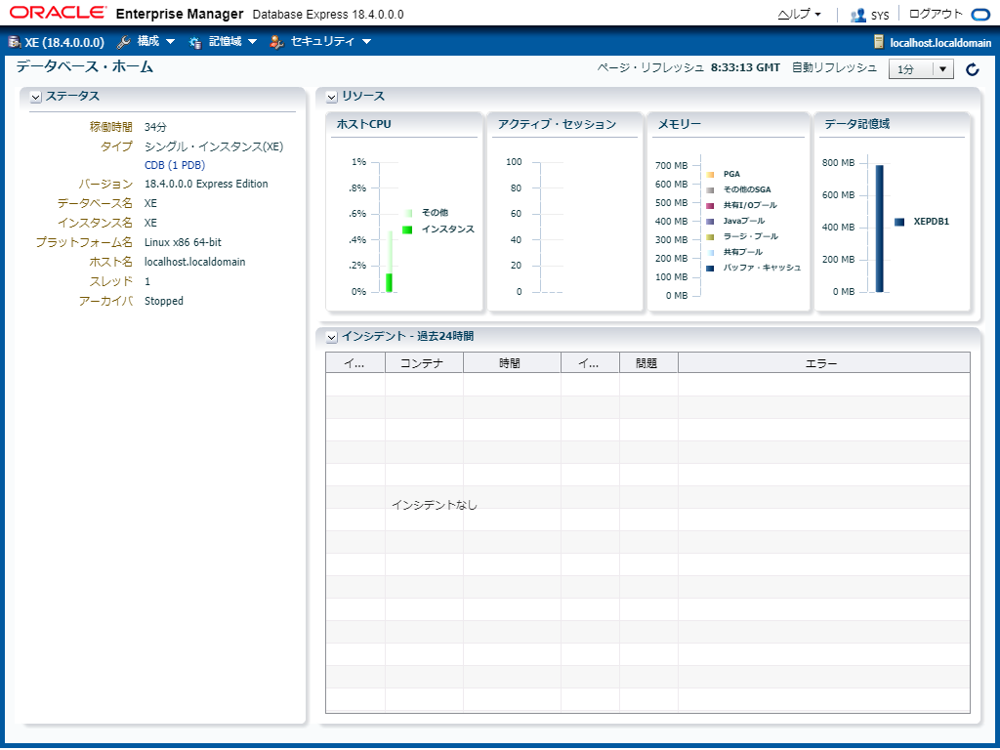

vagrant-oracle-database-xe-18c
==============================

Vagrant + Oracle Linux 7 + Oracle Database 18c XE の簡易セットアップ。

ダウンロード
------------

Oracle Database 18c XEのソフトウェアを[Oracle Technology Network](https://www.oracle.com/technetwork/database/database-technologies/express-edition/downloads/index.html)からダウンロードし、Vagrantfileと同じディレクトリに配置。

* oracle-database-xe-18c-1.0-1.x86_64.rpm

カスタマイズ
------------

`dotenv.sample`というファイルを`.env`という名前のファイルにコピーし、必要に応じて内容を書き換える。

```
# SYS, SYSTEM and PDBADMIN password
ORACLE_PASSWORD=oracle
```

Vagrant設定
-----------

プロキシを利用する必要がある場合、まずvagrant-proxyconfをインストールし、vagrant-proxyconf用の環境変数を設定しておく。

### ホストがmacOS or Linuxの場合 ###

```
export http_proxy=http://proxy.example.com:80
export https_proxy=http://proxy.example.com:80
vagrant plugin install vagrant-proxyconf

export VAGRANT_HTTP_PROXY=http://proxy.example.com:80
export VAGRANT_HTTPS_PROXY=http://proxy.example.com:80
export VAGRANT_FTP_PROXY=http://proxy.example.com:80
export VAGRANT_NO_PROXY=localhost,127.0.0.1
```

### ホストがWindowsの場合 ###

```
SET http_proxy=http://proxy.example.com:80
SET https_proxy=http://proxy.example.com:80
vagrant plugin install vagrant-proxyconf

SET VAGRANT_HTTP_PROXY=http://proxy.example.com:80
SET VAGRANT_HTTPS_PROXY=http://proxy.example.com:80
SET VAGRANT_FTP_PROXY=http://proxy.example.com:80
SET VAGRANT_NO_PROXY=localhost,127.0.0.1
```

セットアップ
------------

`vagrant up`を実行すると、内部的に以下が動く。

* Oracle Linux 7のダウンロードと起動
* Oracle Database 18c XEのインストール
* データベースの作成
* 環境変数の設定
* 自動起動の設定

```
C:\vagrant-oracle-database-xe-18c>vagrant up
Bringing machine 'default' up with 'virtualbox' provider...
==> default: Box 'https://yum.oracle.com/boxes/oraclelinux/latest/ol7-latest.box' could not be found. Attempting to find and install...
    default: Box Provider: virtualbox
    default: Box Version: >= 0
==> default: It looks like you attempted to add a box with a URL for the name...
==> default: Instead, use box_url instead of box for box URLs.
==> default: Box file was not detected as metadata. Adding it directly...
==> default: Adding box 'https://yum.oracle.com/boxes/oraclelinux/latest/ol7-latest.box' (v0) for provider: virtualbox
    default: Downloading: https://yum.oracle.com/boxes/oraclelinux/latest/ol7-latest.box
...
...
(ネットワークやサーバーのスペックによっては数十分かかります。)
...
...
    default: Database creation complete. For details check the logfiles at:
    default:  /opt/oracle/cfgtoollogs/dbca/XE.
    default: Database Information:
    default: Global Database Name:XE
    default: System Identifier(SID):XE
    default: Look at the log file "/opt/oracle/cfgtoollogs/dbca/XE/XE.log" for further details.
    default: Connect to Oracle Database using one of the connect strings:
    default:      Pluggable database: localhost.localdomain/XEPDB1
    default:      Multitenant container database: localhost.localdomain
    default: Use https://localhost:5500/em to access Oracle Enterprise Manager for Oracle Database XE
    default: oracle-xe-18c.service is not a native service, redirecting to /sbin/chkconfig.
    default: Executing /sbin/chkconfig oracle-xe-18c on

C:\vagrant-oracle-database-xe-18c>
```

動作確認(ブラウザ編)
--------------------

ブラウザで https://localhost:5500/em にアクセスし、Enterprise Manager Expressへログイン。





動作確認(ターミナル編)
----------------------

ゲストOSに接続する。

```
C:\vagrant-oracle-database-xe-18c>vagrant ssh
Last login: Thu Oct 25 07:35:16 2018 from 10.0.2.2

Welcome to Oracle Linux Server release 7.5 (GNU/Linux 4.14.35-1818.0.9.el7uek.x86_64)

The Oracle Linux End-User License Agreement can be viewed here:

    * /usr/share/eula/eula.en_US

For additional packages, updates, documentation and community help, see:

    * http://yum.oracle.com/

[vagrant@localhost ~]$
```

ルートに接続する。

```
[vagrant@localhost ~]$ sqlplus system/oracle

SQL*Plus: Release 18.0.0.0.0 - Production on Thu Oct 25 08:37:45 2018
Version 18.4.0.0.0

Copyright (c) 1982, 2018, Oracle.  All rights reserved.

Last Successful login time: Thu Oct 25 2018 08:33:46 +00:00

Connected to:
Oracle Database 18c Express Edition Release 18.0.0.0.0 - Production
Version 18.4.0.0.0

SQL> SHOW CON_NAME

CON_NAME
------------------------------
CDB$ROOT
SQL> exit
Disconnected from Oracle Database 18c Express Edition Release 18.0.0.0.0 - Production
Version 18.4.0.0.0
[vagrant@localhost ~]$
```

PDBに接続し、サンプル表を確認する。

```
[vagrant@localhost ~]$ sqlplus system/oracle@localhost/xepdb1

SQL*Plus: Release 18.0.0.0.0 - Production on Thu Oct 25 08:38:13 2018
Version 18.4.0.0.0

Copyright (c) 1982, 2018, Oracle.  All rights reserved.

Last Successful login time: Thu Oct 25 2018 08:37:45 +00:00

Connected to:
Oracle Database 18c Express Edition Release 18.0.0.0.0 - Production
Version 18.4.0.0.0

SQL> SHOW CON_NAME

CON_NAME
------------------------------
XEPDB1
SQL> SELECT employee_id, first_name, last_name FROM hr.employees WHERE rownum <= 10;

EMPLOYEE_ID FIRST_NAME           LAST_NAME
----------- -------------------- -------------------------
        100 Steven               King
        101 Neena                Kochhar
        102 Lex                  De Haan
        103 Alexander            Hunold
        104 Bruce                Ernst
        105 David                Austin
        106 Valli                Pataballa
        107 Diana                Lorentz
        108 Nancy                Greenberg
        109 Daniel               Faviet

10 rows selected.

SQL> exit
Disconnected from Oracle Database 18c Express Edition Release 18.0.0.0.0 - Production
Version 18.4.0.0.0
[vagrant@localhost ~]$
```

Author
------

[Shinichi Akiyama](https://github.com/shakiyam)

License
-------

[MIT License](http://www.opensource.org/licenses/mit-license.php)
